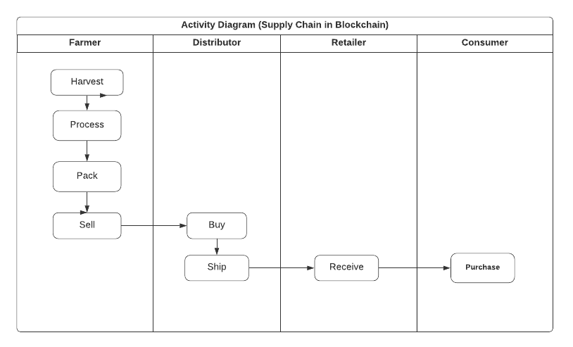
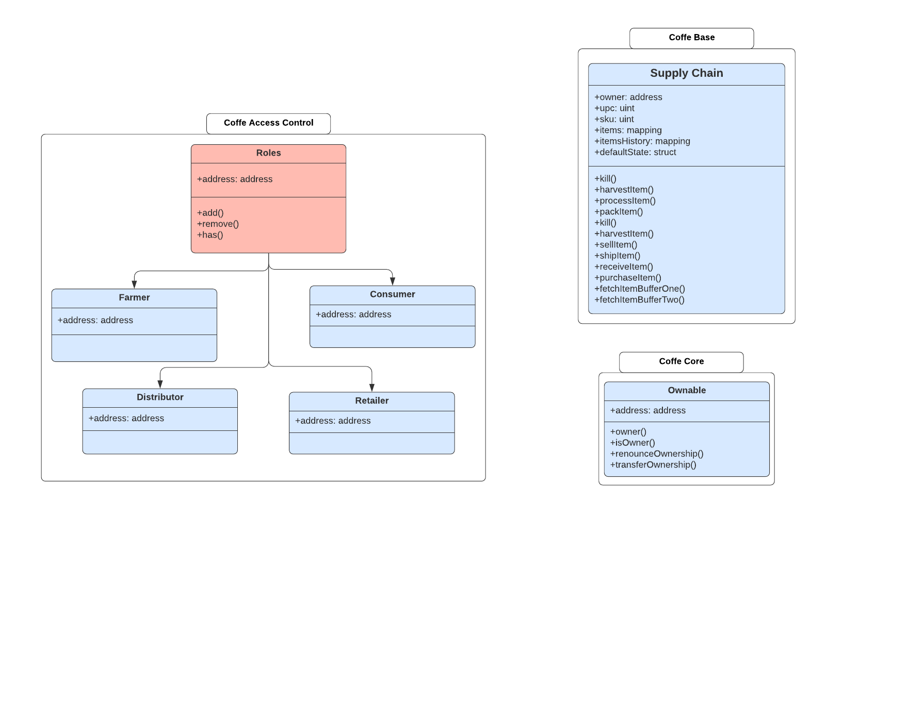
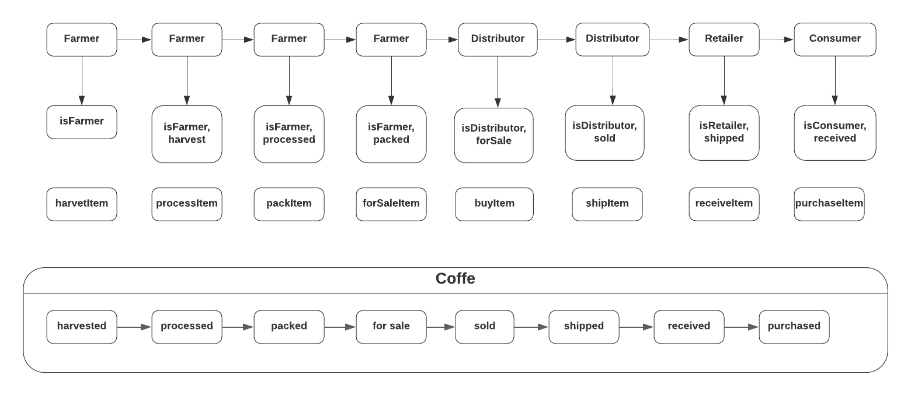
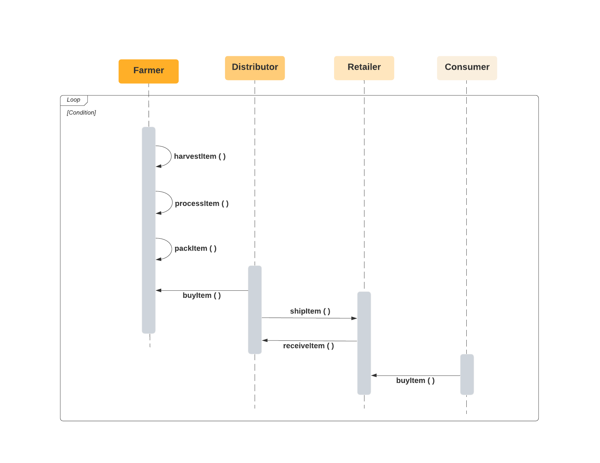

# Supply chain & data auditing

## UML Diagrams
### Activity Diagram

### Class Diagram

### State Diagram

### Sequence Diagram


## Project Write-up
### Libraries
Additional to the libraries included in `package.json` the library ` @truffle/hdwallet-provider` was included to handle the deployment to the Rinkeby network.
### Contract and Deployment
```bash
Contract Address = "0xA3F0e39b27E4D36D33c637954DCBb030FdF93729";
Tx Hash = "0xe3cd23d5d1f2c96897b05f0c61eaaccd4dc2c9fdc023290029c07810801e858a";
```

```bash
Harvested = "0x2de176c74683cae9894e11475f8ac98ee3d91b86b1ca2e703139bec1fff178c9";
Processed = "0xa32d1dc060b00623bc5fa8e6179ad71694fada9b6cbbdd288ae622138c1238fa";
Packed = "0x63010064f4109241c6a595d29a032c874e8c97fcec7e2b1e625c1cc42a08ba7b";
ForSale = "0x88dece21aede73559b23512d5e5e89c1104f6cd39cdb70c7795b454171616db1";
Sold = "0xafa5384b7507778b31584218af310ea8e57b116c06e510b8f4aaa54ae4f9c233";
Shipped = "0x613c9220fb1b1d3dfadfd1f9579b0747c9857c7a62e04f14b403b5dc7fe84b11";
Received = "0x342f5c3f270725e2ccb99a81428742abdd4084bc4484438bae18ca5197dd1b02"
Purchased = "0x90019f8c71bbce6e5cb29eae6a9e47c931eb20b44a3acb3510c6f0ac61dce3d9";
```

## Project

This repository containts an Ethereum DApp that demonstrates a Supply Chain flow between a Seller and Buyer. The user story is similar to any commonly used supply chain process. A Seller can add items to the inventory system stored in the blockchain. A Buyer can purchase such items from the inventory system. Additionally a Seller can mark an item as Shipped, and similarly a Buyer can mark an item as Received.

The DApp User Interface when running should look like...


## Getting Started

These instructions will get you a copy of the project up and running on your local machine for development and testing purposes. See deployment for notes on how to deploy the project on a live system.

### Installing

A step by step series of examples that tell you have to get a development env running

Clone this repository:

```
git clone https://github.com/udacity/nd1309/tree/master/course-5/project-6
```

Change directory to ```project-6``` folder and install all requisite npm packages (as listed in ```package.json```):

```
cd project-6
npm install
```

Launch Ganache:

```
ganache-cli -m "spirit supply whale amount human item harsh scare congress discover talent hamster"
```

Your terminal should look something like this:


In a separate terminal window, Compile smart contracts:

```
truffle compile
```

Your terminal should look something like this:


This will create the smart contract artifacts in folder ```build\contracts```.

Migrate smart contracts to the locally running blockchain, ganache-cli:

```
truffle migrate
```

Your terminal should look something like this:


Test smart contracts:

```
truffle test
```

All 10 tests should pass.


In a separate terminal window, launch the DApp:

```
npm run dev
```

## Built With

* [Ethereum](https://www.ethereum.org/) - Ethereum is a decentralized platform that runs smart contracts
* [IPFS](https://ipfs.io/) - IPFS is the Distributed Web | A peer-to-peer hypermedia protocol
to make the web faster, safer, and more open.
* [Truffle Framework](http://truffleframework.com/) - Truffle is the most popular development framework for Ethereum with a mission to make your life a whole lot easier.


## Authors

See also the list of [contributors](https://github.com/your/project/contributors.md) who participated in this project.

## Acknowledgments

* Solidity
* Ganache-cli
* Truffle
* IPFS
